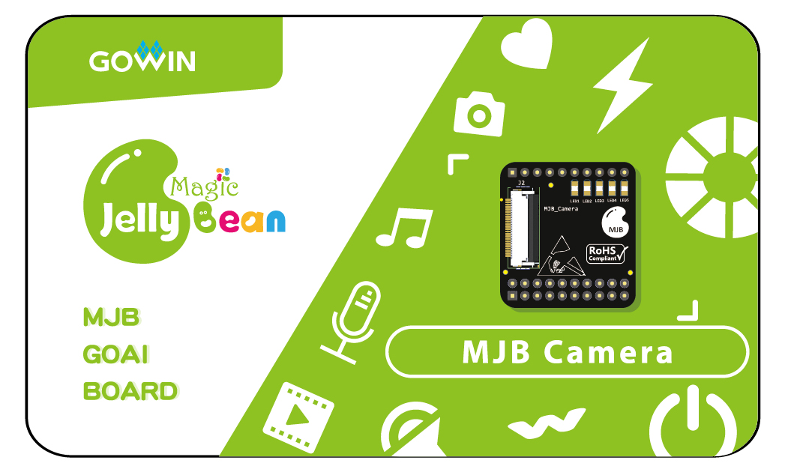
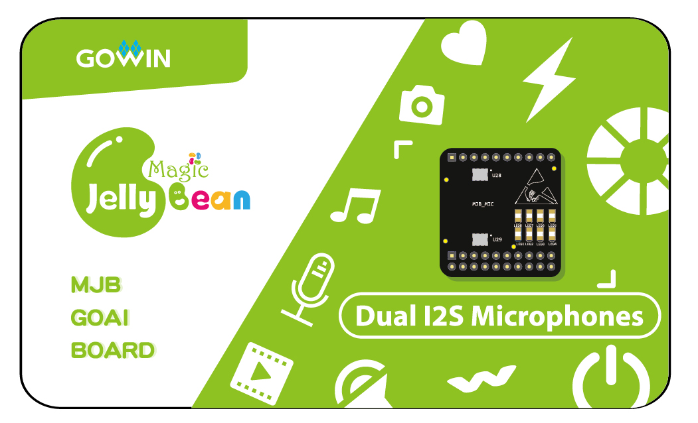
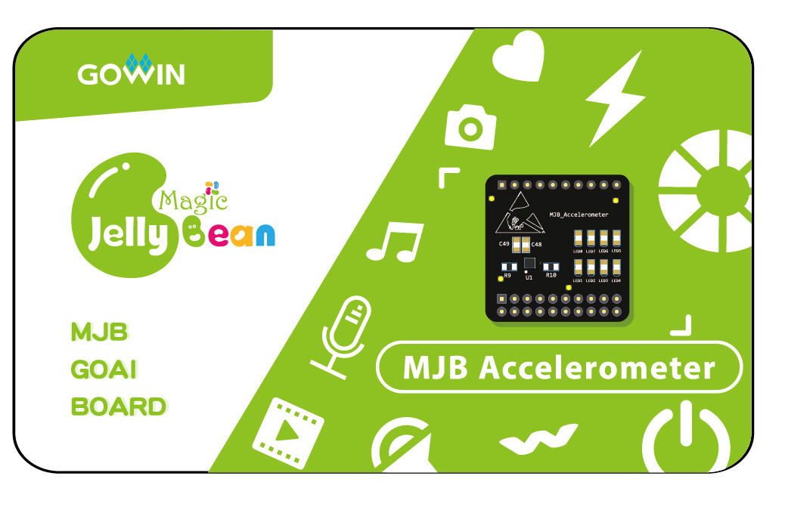

# MJB V1.2 Board

Our new Magic Jelly Bean GOai board Featuring the GW2AR-18-QN88P FPGA

* 20,736-LUT4 FPGA
* On-Chip Block-SRAM 828Kbit
* 10x10mm QFN88 FPGA Package

PCB
* HDMI RX and HDMI TX
* Internal 2x32Mbit PSRAM
* On-Board 64Mbit SPI-FLASH
* LED Indicator
* OLED Display Connector
* USB Programmer
* DC5V è 3V、2.8V、2.5V、1.8V、1.2V、1.0V
* PCB Size: 6cm x 6.6cm

# MJB V1.2 Board Accessories

## MJB Camera 

The MJB Camera Board will allow you to use a OV2640 Camera Module with the MJB Board. The OV2640 is a SOC sensor that has an on-chip ISP which can do auto-exposure, auto-white balance, all in a small package. Ideal for creating great images at a miniature cost.

## MJB Microphone

This tiny, low power microphone comes with an I2S digital output which allows direct interconnect with our MJB board. Ideal for smaller devices where size and power consumption are a constraint.

## MJB Accelerometer

The LIS2DH12 accelerometer comes with 8 LEDs and is fully compatible with your MJB board. Accelerometers are devices that measure the change in velocity and sense vibrations within systems. A common use for accelerometers for handheld devices would be rotating a display once sensing the physical change of orientation. The LIS2DH12 accelerometer comes with 8 LEDs

*/pic - high res and thumbnail pictures of the minieye and accessory boards and Demo videos

*/doc - user guide

*/pcb - schematic pdfs

*/rtl - FPGA example designs

*/sw - any additional software for the examples
